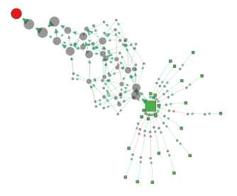

# Semantic Space Search Trajectory Networks

Semantic Space Search Trajectory Networks (SSSTNs) are graph-based representations designed for the qualitative and quantitative analysis of optimization trajectories produced by machine learning algorithms. This repository contains all the code required to reproduce the results presented in the **Semantic Space Search Trajectory Networks** paper, as well as the tools needed to build custom Semantic Space STNs for arbitrary optimization processes.

<p align="center">
  
</p>

## Requirements

### Hardware

* A CUDA-compatible GPU is recommended for training the neural networks.
* Building the largest STNs currently requires a machine with at least **30 GB of RAM**.

### Software

* CUDA installed and properly configured on your system.
* [uv](https://docs.astral.sh/uv/) installed.

## Installation

1. Clone the repository:

```bash
# HTTPS
git clone https://github.com/JulAgu/SSSTN.git
```

or

```bash
# SSH
git clone git@github.com:JulAgu/SSSTN.git
```

2. Navigate to the project directory and initialize the Python environment:

```bash
cd SSSTN
uv init
```


## Reproducing the paper results step by step

Every command below is run from the repository root with `uv run`. Data is downloaded from OpenML on the fly, so the first run of each dataset needs network access.

The paper uses two suites of datasets and three algorithm families :

| Task | Datasets | Algorithms |
|------|----------|------------|
| Classification (OpenML-CC18) | `Bioresponse` `CIFAR_10` `Fashion-MNIST` `mnist_784` | MLP, XGBoost |
| Regression (OpenML-CTR23) | `cars` `cpu_activity` `energy_efficiency` | MLP, XGBoost, Symbolic Regression |

### 1. Training Machine Learning Algorithms

Each training script fetches the requested datasets, instantiate the fold-0 train/test split, trains one model per random seed and pickles the full training trajectory (`trace`) of every run. The number of runs is set by the `N_INITS` constant at the top of each script (the paper uses 20–30).

> `A_first_exploration_overfitting.py` / `AR_first_exploration_overfitting.py`
> are preliminary overfitting probes and are **not** required to reproduce the paper results. `Cxg` / `CRxg` (shuffled-label XGBoost) are likewise optional the generalization study (Section 5) is run on MLPs only.

```bash
# MLP: real + shuffled labels ---
uv run B_train_test_conventional_cycle.py  --datasets Bioresponse CIFAR_10 Fashion-MNIST mnist_784
uv run C_overfitting_multi_init_cycle.py   --datasets Bioresponse CIFAR_10 Fashion-MNIST mnist_784
uv run BR_train_test_conventional_cycle.py --datasets cars cpu_activity energy_efficiency
uv run CR_overfitting_multi_init_cycle.py  --datasets cars cpu_activity energy_efficiency

# XGBoost & SR: real labels
uv run Bxg_train_test_conventional_cycle.py  --datasets Bioresponse CIFAR_10 Fashion-MNIST mnist_784
uv run BRxg_train_test_conventional_cycle.py --datasets cars cpu_activity energy_efficiency
uv run BRsr_train_test_conventional_cycle.py --datasets cars cpu_activity energy_efficiency

# MLP: progressive MNIST label corruption (Fig. 6, levels 20/40/60/80)
for pct in 20 40 60 80; do
  uv run D_partial_corruption_multi_init_cycle.py --datasets mnist_784 --corruption $pct --n-inits 20
done
```

> The 0% and 100% panels of Fig. 6 reuse the base MNIST STN (real / random) built

**Organize the runs ** The STN builder reads a flat folder of `.pkl` files, so the raw outputs are sorted into the task-specific subfolders the rest of the pipeline expects:

```bash
# MLP runs -> classification_NN / regression_NN
mkdir -p results/classification_NN results/regression_NN
mv results/*_{Bioresponse,CIFAR_10,Fashion-MNIST,mnist_784}.pkl results/classification_NN/
mv results/*_{cars,cpu_activity,energy_efficiency}.pkl          results/regression_NN/

# XGBoost runs -> classification_xgb / regression_xgb
mkdir -p results_xgb/classification_xgb results_xgb/regression_xgb
mv results_xgb/*_{Bioresponse,CIFAR_10,Fashion-MNIST,mnist_784}.pkl results_xgb/classification_xgb/
mv results_xgb/*_{cars,cpu_activity,energy_efficiency}.pkl          results_xgb/regression_xgb/

# SR runs are already read directly from results_sr/

# MNIST corruption runs -> one folder per level
mkdir -p results/mnist_incremental_corruption/corrupt{20,40,60,80}
for pct in 20 40 60 80; do
  mv results/corrupt${pct}pct_*.pkl results/mnist_incremental_corruption/corrupt${pct}/
done
```

### 2. Results Analysis

These read the raw run files (before any STN is built) and compute the performance metrics.

```bash
# Test fitness per (dataset, algorithm) -- mean +- std over runs (Table 3).
# Run once per algorithm folder; accuracy for classification, R^2 for regression.
uv run utilities/results_table.py results/classification_NN
uv run utilities/results_table.py results/regression_NN
uv run utilities/results_table.py results_xgb/classification_xgb
uv run utilities/results_table.py results_xgb/regression_xgb
uv run utilities/results_table.py results_sr

# Real-vs-shuffled MLP summary -> results/summarizing/perf_table_*.csv
uv run utilities/build_perf_tables.py
```

### 3. Building Semantic Space STNs

`uv run -m src.stn` builds one STN per condition (`dataset:label_type`) from a folder of run files.

**The $\tau$ and stride values below match the paper experiments.**

<details>
<summary><b>Algorithm comparison — real labels, 30 runs (Fig. 1 &amp; 2)</b></summary>

```bash
# MLP (classification -> results/stn_30, regression -> results/stn_30)
uv run -m src.stn --results results/classification_NN --location hamming --out results/stn_30 --hamming-threshold 0.3 --stride 1 --max-runs 30 --only CIFAR_10:real
uv run -m src.stn --results results/classification_NN --location hamming --out results/stn_30 --hamming-threshold 0.1 --stride 1 --max-runs 30 --only mnist_784:real
uv run -m src.stn --results results/classification_NN --location hamming --out results/stn_30 --hamming-threshold 0.1 --stride 1 --max-runs 30 --only Fashion-MNIST:real
uv run -m src.stn --results results/classification_NN --location hamming --out results/stn_30 --hamming-threshold 0.1 --stride 1 --max-runs 30 --only Bioresponse:real
uv run -m src.stn --results results/regression_NN --location quantize --out results/stn_30 --quant-threshold 0.2 --stride 5 --max-runs 30 --only cars:real
uv run -m src.stn --results results/regression_NN --location quantize --out results/stn_30 --quant-threshold 0.4 --stride 5 --max-runs 30 --only cpu_activity:real
uv run -m src.stn --results results/regression_NN --location quantize --out results/stn_30 --quant-threshold 0.2 --stride 5 --max-runs 30 --only energy_efficiency:real

# XGBoost (-> results_xgb/stn_30)
uv run -m src.stn --results results_xgb/classification_xgb --location hamming --out results_xgb/stn_30 --hamming-threshold 0.05 --stride 1 --max-runs 30 --only Bioresponse:real
uv run -m src.stn --results results_xgb/classification_xgb --location hamming --out results_xgb/stn_30 --hamming-threshold 0.3 --stride 1 --max-runs 30 --only CIFAR_10:real
uv run -m src.stn --results results_xgb/classification_xgb --location hamming --out results_xgb/stn_30 --hamming-threshold 0.05 --stride 1 --max-runs 30 --only Fashion-MNIST:real
uv run -m src.stn --results results_xgb/classification_xgb --location hamming --out results_xgb/stn_30 --hamming-threshold 0.05 --stride 1 --max-runs 30 --only mnist_784:real
uv run -m src.stn --results results_xgb/regression_xgb --location quantize --out results_xgb/stn_30 --quant-threshold 0.2 --stride 1 --max-runs 30 --only cpu_activity:real
uv run -m src.stn --results results_xgb/regression_xgb --location quantize --out results_xgb/stn_30 --quant-threshold 0.15 --stride 1 --max-runs 30 --only cars:real
uv run -m src.stn --results results_xgb/regression_xgb --location quantize --out results_xgb/stn_30 --quant-threshold 0.15 --stride 1 --max-runs 30 --only energy_efficiency:real

# Symbolic Regression (-> results_sr/stn_30)
uv run -m src.stn --results results_sr --location quantize --out results_sr/stn_30 --quant-threshold 0.4 --stride 1 --max-runs 30 --only cpu_activity:real
uv run -m src.stn --results results_sr --location quantize --out results_sr/stn_30 --quant-threshold 0.2 --stride 1 --max-runs 30 --only cars:real
uv run -m src.stn --results results_sr --location quantize --out results_sr/stn_30 --quant-threshold 0.2 --stride 1 --max-runs 30 --only energy_efficiency:real
```
</details>

<details>
<summary><b>Real vs shuffled — MLP, 20 runs (Fig. 5)</b></summary>

```bash
uv run -m src.stn --results results/classification_NN --location hamming --out results/stn_20 --hamming-threshold 0.3 --stride 1 --max-runs 20 --only CIFAR_10:real
uv run -m src.stn --results results/classification_NN --location hamming --out results/stn_20 --hamming-threshold 0.3 --stride 1 --max-runs 20 --only CIFAR_10:random
uv run -m src.stn --results results/classification_NN --location hamming --out results/stn_20 --hamming-threshold 0.1 --stride 1 --max-runs 20 --only mnist_784:real
uv run -m src.stn --results results/classification_NN --location hamming --out results/stn_20 --hamming-threshold 0.1 --stride 1 --max-runs 20 --only mnist_784:random
uv run -m src.stn --results results/classification_NN --location hamming --out results/stn_20 --hamming-threshold 0.1 --stride 1 --max-runs 20 --only Fashion-MNIST:real
uv run -m src.stn --results results/classification_NN --location hamming --out results/stn_20 --hamming-threshold 0.1 --stride 1 --max-runs 20 --only Fashion-MNIST:random
uv run -m src.stn --results results/classification_NN --location hamming --out results/stn_20 --hamming-threshold 0.1 --stride 1 --max-runs 20 --only Bioresponse:real
uv run -m src.stn --results results/classification_NN --location hamming --out results/stn_20 --hamming-threshold 0.1 --stride 1 --max-runs 20 --only Bioresponse:random
uv run -m src.stn --results results/regression_NN --location quantize --out results/stn_20 --quant-threshold 0.2 --stride 5 --max-runs 20 --only cars:real
uv run -m src.stn --results results/regression_NN --location quantize --out results/stn_20 --quant-threshold 0.2 --stride 5 --max-runs 20 --only cars:random
uv run -m src.stn --results results/regression_NN --location quantize --out results/stn_20 --quant-threshold 0.4 --stride 5 --max-runs 20 --only cpu_activity:real
uv run -m src.stn --results results/regression_NN --location quantize --out results/stn_20 --quant-threshold 0.4 --stride 5 --max-runs 20 --only cpu_activity:random
uv run -m src.stn --results results/regression_NN --location quantize --out results/stn_20 --quant-threshold 0.2 --stride 5 --max-runs 20 --only energy_efficiency:real
uv run -m src.stn --results results/regression_NN --location quantize --out results/stn_20 --quant-threshold 0.2 --stride 5 --max-runs 20 --only energy_efficiency:random
```
</details>

<details>
<summary><b>Clustering-threshold sweep $\tau$ (Fig. 3)</b></summary>

```bash
# classification (Bioresponse) and regression (cars) across tau = 0.1..0.4
for tau in 0.1 0.2 0.3 0.4; do
  uv run -m src.stn --results results/classification_NN --location hamming  --out results/stn_hamming_$tau --hamming-threshold $tau --stride 1 --max-runs 30 --only Bioresponse:real
  uv run -m src.stn --results results/regression_NN     --location quantize --out results/stn_hamming_$tau --quant-threshold   $tau --stride 5 --max-runs 30 --only cars:real
done
```
</details>

<details>
<summary><b>Robustness to the number of runs (Fig. 4)</b></summary>

```bash
for n in 10 20 30; do
  uv run -m src.stn --results results/classification_NN    --location hamming  --out results/stn_nor_$n     --hamming-threshold 0.3  --stride 1 --max-runs $n --only CIFAR_10:real
  uv run -m src.stn --results results_xgb/regression_xgb   --location quantize --out results_xgb/stn_nor_$n  --quant-threshold   0.2  --stride 1 --max-runs $n --only cpu_activity:real
done
```
</details>

<details>
<summary><b>Progressive MNIST label corruption (Fig. 6)</b></summary>

```bash
# 0% and 100% endpoints come from the base MNIST STN (real / random)
uv run -m src.stn --results results/classification_NN --location hamming --hamming-threshold 0.1 --stride 1 --max-runs 20 --only mnist_784:real
uv run -m src.stn --results results/classification_NN --location hamming --hamming-threshold 0.1 --stride 1 --max-runs 20 --only mnist_784:random
# intermediate corruption levels
for pct in 20 40 60 80; do
  uv run -m src.stn --results results/mnist_incremental_corruption/corrupt$pct --location hamming --out results/stn_corrupt$pct --hamming-threshold 0.1 --stride 1 --max-runs 20 --only mnist_784:real
done
```
</details>

### 4. Analysing Semantic Space STNs and building figures

**Topological measures.** These load a folder of built STNs and write the
measure tables (and, for `--paired`, the real-vs-random study of Table 4).

```bash
# Structural (label-agnostic) measures + paired real-vs-random study (Table 4)
uv run -m src.stn.nx_metrics --stn-dir results/stn_20/hamming --paired
uv run -m src.stn.nx_metrics --stn-dir results/stn_20/quantize --paired

# Label-aware (attribute) measures
uv run -m src.stn.label_metrics --stn-dir results/stn_20/hamming
```

**Figures.** Each script reads the STN roots built in step 3 and writes a PDF to
`results/figures/`.

| Script | Paper figure | Reads from |
|--------|--------------|------------|
| `scripts_for_figures/real_algo_comparison.py` | Fig. 1 & 2 (MLP / XGB / SR, real) | `results/stn_30`, `results_xgb/stn_30`, `results_sr/stn_30` |
| `scripts_for_figures/threshold_sweep.py`      | Fig. 3 ($\tau$ sweep)            | `results/stn_hamming_<$\tau$>` |
| `scripts_for_figures/runs_sweep.py`           | Fig. 4 (#runs robustness)  | `results/stn_nor_<n>`, `results_xgb/stn_nor_<n>` |
| `scripts_for_figures/real_vs_random_split.py` | Fig. 5 (real vs shuffled)  | `results/stn_20` |
| `scripts_for_figures/corruption_sweep.py`     | Fig. 6 (MNIST corruption)  | `results/stn`, `results/stn_corrupt{20,40,60,80}` |

Build every figure at once:

```bash
uv run scripts_for_figures/real_algo_comparison.py
uv run scripts_for_figures/threshold_sweep.py
uv run scripts_for_figures/runs_sweep.py
uv run scripts_for_figures/real_vs_random_split.py
uv run scripts_for_figures/corruption_sweep.py
```
